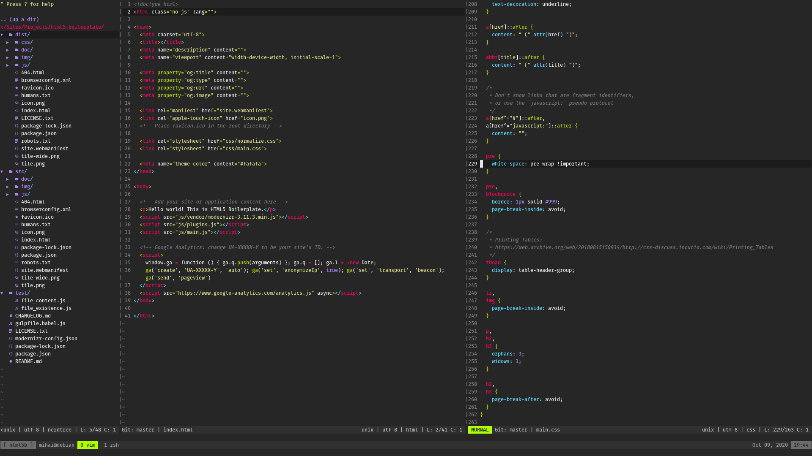

# Dotfiles - [tehmachine](https://github.com/tehmachine/dotfiles)

This repo serves mainly as a backup for my dotfiles but feel free to reference it for your own endeavors and/or make suggestions. This dir sits in `~/bin` with appropriate symlinks in `~`. Note I am using Linux and some aliases may need to be adapted to your OS.

## Tmux + Vim

Tmux has been set up to have a powerline feel without any additional plugins but [Powerline fonts](https://github.com/powerline/fonts) will be required for additional symbols. Vim uses a custom statusline, in which powerline symbols can be toggled.

