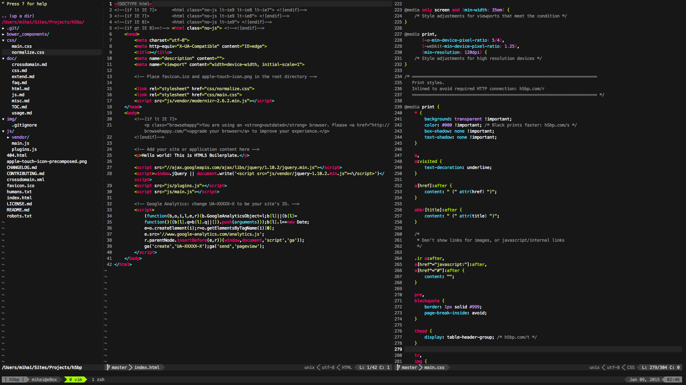

# Dotfiles

This repo serves mainly as a backup for my dotfiles but feel free to reference it for your own endeavors and/or make suggestions. This dir sits in ~/bin with appropriate symlinks in ~. Note I am using Mac OS X and some aliases may need to be adapted for your operating system.

## Tmux + Vim

Tmux has been set up to have a powerline feel without any additional plugins but [Powerline fonts](https://github.com/powerline/fonts) will be required for additional symbols. Vim does utilize [lightline.vim](https://github.com/itchyny/lightline.vim) for the statusline as well as [fugitive.vim](https://github.com/tpope/vim-fugitive) for Git display.

