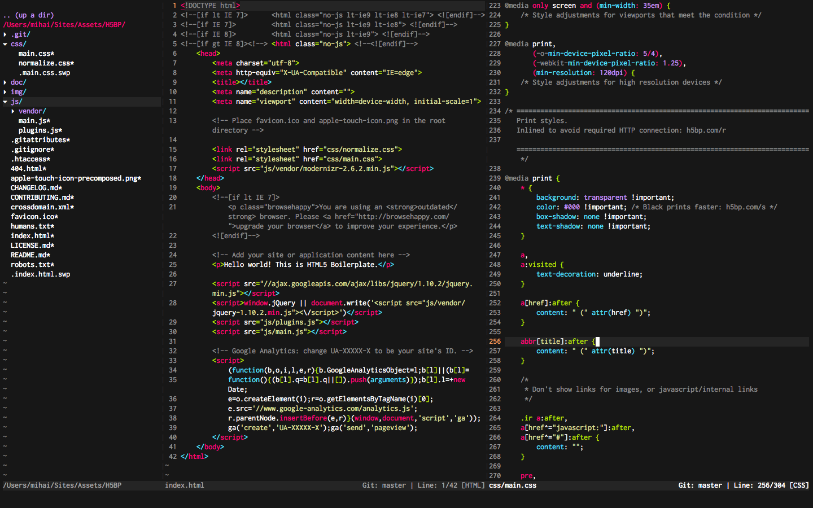

# Dotfiles

This repo serves mainly as a backup for my dotfiles but feel free to reference it for your own endeavors and/or make suggestions. This dir sits in ~/bin with appropriate symlinks in ~. Note I am using Mac OS X and some aliases may need to be adapted for your operating system.

## Vim

Over the past months I've been asked about my Vim config and theme so check that out. Vundle's my plugin manager and a slightly tweaked Monokai serves as my color scheme.
Check out the screenshot below and click it for full size.

